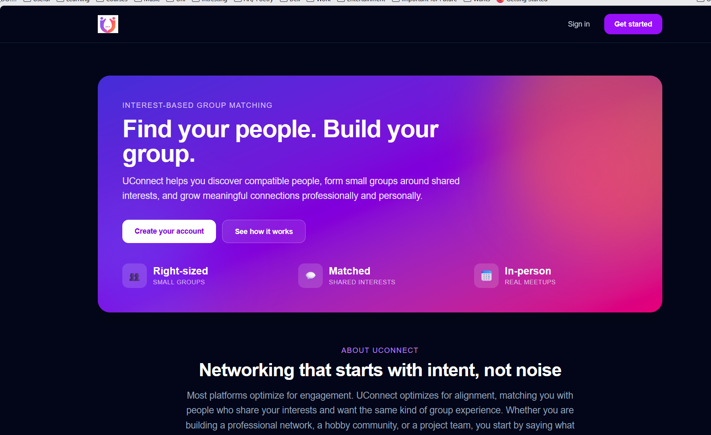
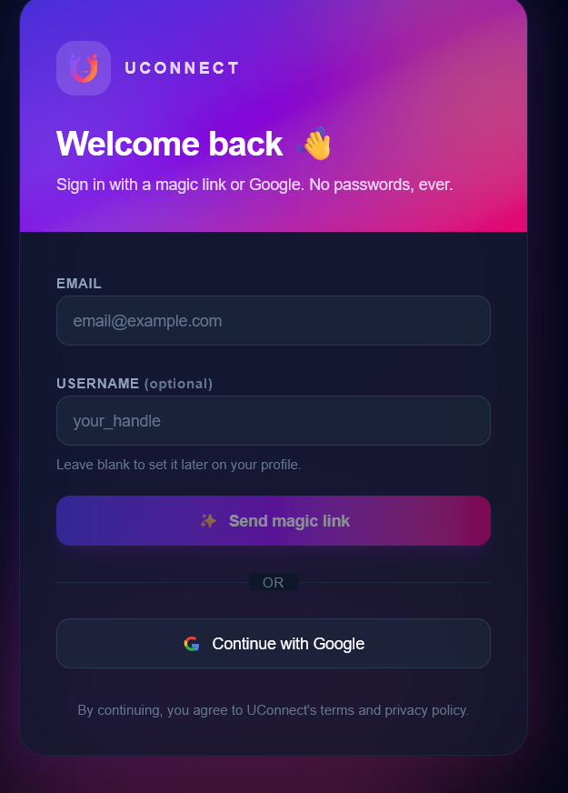
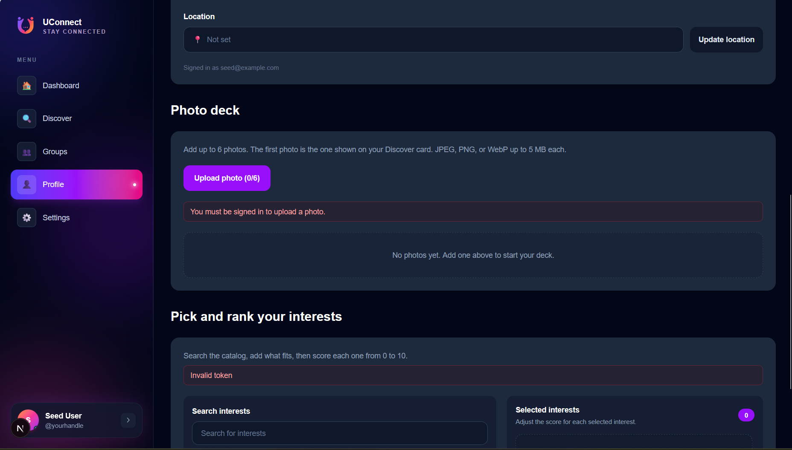
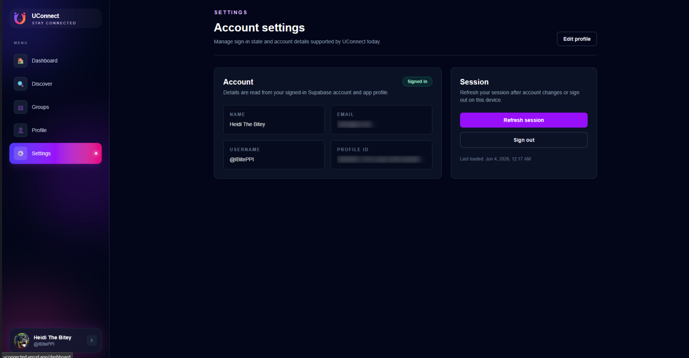

# UConnect

UConnect is a UW-focused social matching platform for helping students form small groups around shared interests, activities, events, and mutual intent. The current product surface is the Next.js web app, backed by a Fastify API, Supabase Auth/Realtime/Storage, Prisma, PostgreSQL, and pgvector. An Expo mobile app scaffold is included and planned for a fuller future release.

Live site: https://uconnected.vercel.app

## Reviewer Quickstart

- Live app: https://uconnected.vercel.app
- Start at `/` for the landing page and project overview.
- Use `/auth` to sign in or create an account.
- Try `/discover` to review match cards and swipe on compatible people.
- Try `/groups` to open group chats and planning spaces.
- Use `/profile` to edit profile details, interests, location, and photos.
- Use `/settings` to review account/session controls.

## App Preview

| Landing | Sign in |
| --- | --- |
|  |  |

| Profile editing | Account settings |
| --- | --- |
|  |  |

## Structure

- `apps/web` - Next.js 16 App Router + React 19 + Tailwind CSS v4 web app
- `apps/api` - Fastify 5 API server written in TypeScript
- `apps/mobile` - Expo + React Native + TypeScript scaffold
- `packages/db` - Prisma schema, migrations, seed data, and generated client
- `packages/shared` - shared TypeScript/Zod types and schemas
- `scripts` - local setup and embedding utilities
- `supabase` - Supabase Local configuration and migrations support

## Current Features

- Supabase-backed authentication for web clients.
- User profiles with usernames, display names, bios, interests, locations, and photo storage.
- Interest catalog seeded from Prisma data, with interest DAG relationships and optional semantic embeddings.
- Discovery and swipe-based matching.
- Group-seeking preferences for forming compatible small groups.
- App-formed and user-created groups with membership tracking.
- Group chats with realtime broadcast support, seen receipts, and event proposal messages.
- Events with attendee RSVP status and group subscriptions.
- Recent activity and dashboard views in the web app.

## Prerequisites

- Node.js 20 or newer
- pnpm via Corepack (`corepack enable`)

For the recommended local setup, you also need:

- Docker, because Supabase Local runs in containers
- Supabase CLI (`supabase`)

## Local Setup

This repo is designed to run locally with Supabase Local for closest parity with hosted Supabase.

### One-command bootstrap

```bash
pnpm install
pnpm setup:local
```

`pnpm setup:local` will:

- start Supabase Local with `supabase start`
- write a root `.env` using local URLs and keys from `supabase status`
- write `apps/web/.env.local` with `NEXT_PUBLIC_SUPABASE_URL`, `NEXT_PUBLIC_SUPABASE_ANON_KEY`, and `NEXT_PUBLIC_API_URL`
- run Prisma generate, apply migrations, and seed the database

Then start the apps you need:

```bash
pnpm dev:web
pnpm dev:api
pnpm dev:mobile
```

You can also run all three dev servers together:

```bash
pnpm dev
```

### Manual local setup

If you prefer to do it step by step:

```bash
pnpm install
cp .env.example .env
supabase start
pnpm -C packages/db generate
pnpm -C packages/db prisma migrate deploy
pnpm -C packages/db seed
pnpm dev:api
pnpm dev:web
```

Ports are configured in `supabase/config.toml`. The API defaults to port `4000` through `API_PORT`, and the web app expects `NEXT_PUBLIC_API_URL` to point at the API.

Environment notes:

- API and Prisma load the root `.env`; if present, root `.env.local` overrides it.
- The web app reads public browser env from `apps/web/.env.local`.
- In development, API CORS allows localhost origins when `API_CORS_ORIGINS` is unset.
- Never commit `.env` or `.env.local` files because they contain secrets.

## Hosted Supabase

A hosted deployment uses a Supabase project for Auth, Postgres, Storage, and Realtime with the same API routes.

1. Create a Supabase project.
2. Copy the project URL, anon key, and service role key into a root `.env` using `.env.example` as the starting point.
3. Set `DATABASE_URL` to the hosted Supabase Postgres connection string.
4. Apply schema changes:

```bash
pnpm -C packages/db prisma generate
pnpm -C packages/db prisma migrate deploy
```

For production workflows, prefer `prisma migrate deploy` over `prisma migrate dev`.

## Database

Prisma lives in `packages/db` and targets PostgreSQL. The schema models users, interests, profile photos, user locations, swipes, group-seeking preferences, group formation proposals, groups, chats, events, RSVPs, and group event subscriptions.

The starter interest catalog is seeded from `packages/db/prisma/interest-data.json` through `packages/db/prisma/seed.js`. Add new default interests there, then rerun:

```bash
pnpm -C packages/db seed
```

Direct browser access to application tables is blocked through row-level security. Web and mobile clients should use the API for application data. Routes such as `/interests`, `/me`, `/matching`, `/groups`, `/chats`, `/events`, and `/activity` require valid Supabase authentication where appropriate.

### Generating Embeddings

Interests are embedded with the `all-mpnet-base-v2` model running in Docker via [Text Embeddings Inference (TEI)](https://github.com/huggingface/text-embeddings-inference).

Start the embedding service:

```bash
docker run -p 8080:80 -v hf_cache:/data --pull always ghcr.io/huggingface/text-embeddings-inference:cpu-latest --model-id sentence-transformers/all-mpnet-base-v2 --pooling mean --dtype float16
```

For NVIDIA GPU acceleration:

```bash
docker run --gpus all -p 8080:80 -v hf_cache:/data --pull always ghcr.io/huggingface/text-embeddings-inference:cuda-latest --model-id sentence-transformers/all-mpnet-base-v2 --pooling mean --dtype float16
```

Then run the embedding script from the repo root:

```bash
node scripts/compute-embeddings.mjs
```

The script health-checks the embedding service, fetches interests from the database, generates 768-dimensional embeddings, and stores them in `InterestEmbedding` for pgvector cosine similarity search.

## Postgres Without Supabase

If you cannot install the Supabase CLI yet, you can run a standalone local Postgres database with Docker Compose. This is useful for database work, but it does not provide Supabase Auth, Storage, or Realtime.

```bash
docker compose up -d
pnpm -C packages/db generate
pnpm -C packages/db prisma migrate deploy
pnpm -C packages/db seed
```

## Quality Checks

Run checks from the repo root:

```bash
pnpm lint
pnpm typecheck
pnpm -C apps/web test
pnpm -C apps/api test
```

What these cover:

- `pnpm lint` runs ESLint across the workspace.
- `pnpm typecheck` runs TypeScript checks across the workspace.
- `pnpm -C apps/web test` runs Jest tests for web hooks and client utilities.
- `pnpm -C apps/api test` runs Node test suites for API routes and service helpers.

## Future Work

- Build out the planned mobile version from the existing Expo scaffold so students can use UConnect naturally on iOS and Android.
- Continue improving matching quality with interest embeddings, location-aware scoring, and group formation feedback.
- Expand event discovery, event proposal workflows, and group-level planning tools.
- Prepare deployment documentation for the hosted web app, API, and Supabase project.

## Notes

- pnpm uses the same npm registry and packages as npm; it is just a different package manager.
- Avoid running installs inside `apps/*` or `packages/*`. Use the repo root.
- The API's `/health` endpoint works without Supabase env; authenticated application routes require Supabase env vars and a valid access token.

## Contributing

Use feature branches and open PRs into `main`. See `CONTRIBUTING.md`.
